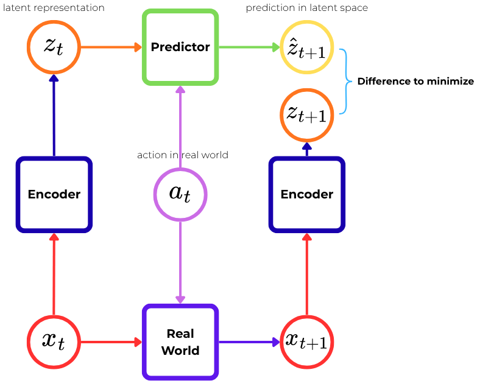

# The JEPA framework

The scope of this document is to provide an introduction to the framework of the *Joint-Embedding Predictive Architecture* (JEPA), covering at first the seminal ideas, and then the functional components of the state-of-the-art models. \
Finally, we will present our proposal for a new, stable and end-to-end trainable JEPA model.

---

## Contents
<!-- TOC -->
* [The JEPA framework](#the-jepa-framework)
  * [Contents](#contents)
  * [Self-Supervised Learning](#self-supervised-learning)

    * [Contrastive Learning](#contrastive-methods)
    * [Generative Algorithms](#generative-algorithms)

  * [JEPA architecture](#the-jepa-framework)
  * [AV-JEPA](#av-jepa)
  * [LeWorldModel](#leworld-model)
  * [References](#main-references)
<!-- TOC -->

---

## Self-Supervised Learning

The JEPA framework belongs to a class of algorithms under the wide umbrella of *self-supervised learning* (SSL). \
The idea behind SSL is to train models that generate output labels "intrinsically" from input data, so to reveal hidden relationships between data components or different views of data. \
Yann LeCun defined SSL as "a process to complete, or reconstruct, missing information", by, e.g., predicting any part of the input given any other part, or by predicting future from the past.

It turns out that SSL algorithms are extremely able to solve not only the primary goal of the training process, but many other secondary (**proxy**) tasks: for example, models trained for image classification by using the SSL principle are able to predict images rotation or to predict colored versions given a gray-scale image.  

Under the umbrella of SSL fall lots of approaches that can be grouped into two main categories: contrastive methods and generative algorithms.

### Contrastive Methods

Contrastive learning is a self-supervised learning technique whose aim is to train models able to distinguish between similar (**positive**) and dissimilar (**negative**) data inputs.

The general framework consists of three main steps. \
Raw data samples (the **anchor points**) are processed by data-augmentation methods; since the resulting new data will be in some way "similar" to the anchor. All the remaining data, instead, are considered negative examples. \
The examples are then encoded into a higher-dimensional space. A *projection head* then projects this embedded representation to a low-dimensional space. This step is done for the anchor and for all the positive and negative examples. \
Finally, in the third step, a **contrastive loss** computes the distances between similar and dissimilar data in this latent space.

The way positive and negative examples are chosen is extremely important. 
Usually, the number of negatives provided to the network is much higher than the number of positives. \
Since the number of negative examples is usually enormous to manage, two different solutions have been found. \
**SimCLR** employs a batch sampling strategy of size $N$. From the samples, $2N$ augmented pairs are generated. One pair is treated as a positive pair, while the other samples are considered negative. \
The main disadvantage of this approach is that it requires a high memory. 

Another approach consists into storing not raw data, but sample embeddings. In this way, the use of memory is extremely lower. The loss is computed w.r.t. to all these embeddings.
However, since the updates also regard the encoder, the stored embeddings will become soon useless. \
To prevent this, the **MoCo** architecture defines a momentum encoder, i.e., a copy of the data encoder. The momentum one is responsible for the embeddings of negatives, and its weights $\theta_k$ using an exponential smoothing w.r.t. the data encoder weights $\theta_q$:
$$
    \theta_k = \alpha \theta_k + (1-\alpha) \theta_q
$$

The definition of the loss is mostly case-dependent. \
Some common solutions are:

* **Noise-contrastive estimation (NCE)**

$$
    \mathcal{L}(\theta) = \sum_{i=1}^n \log \frac{p_\theta(y_i | x)}{p_\theta(y_i | x) + kp_k(y_i|x)} + \sum_{j=1}^m \log \frac{p_k(y_j | x)}{p_\theta(y_j | x) + kp_k(y_j|x)}
$$
    where $k$ is the number of negative samples, $p_k$ their distribution, $n$ the number of positives and $p_\theta$ their distribution. \
    This loss reduces the problem to a binary classification (similar/dissimilar).

* **Info Noise-contrastive estimation (NCE)**

$$
    \mathcal{L}(\theta) = -\log \frac{\exp(\frac{q \cdot k^+}{\tau})}{\sum_{i=0}^K \exp{\frac{q \cdot k_i}{\tau}} }
$$
    where $q$ is the embedding of the ancor, $k^+$ is the embedding of the (unique) positive sample and $K$ is the set of the (multiple) negatives. \
    Its goal is to maximize the mutual information between positive samples pairs while minimizing the mutual information between negative samples pairs. \
    InfoNCE Loss has been used in the *MoCo* architecture.

* **Cross-entropy loss**
    $$
        \mathcal{L} = -\log \frac{1}{\mathbf{B}} \sum_j^\mathbf{B} \sum_i^n y_i \log y_j
    $$
    where $\mathbf{B}$ is the batch size.

Negative examples are not strictly required by contrastive learning algorithms, and they can be substituted by using **siamese networks**. \
Siamese networks aim to just maximize the similarity between two augmented versions of a single data point, while incorporating conditions and regularization so to prevent *collapsing* solutions, i.e., all the data are mapped to a single point. \
Usually, one network is kept fixed or updated more slowly (the *teacher*), while the other is continuously updated (the *student*). \
This kind of approach is called *self-distillation-based contrastive learning*.
Two notable algorithms are **SimSiam** and **BYOL**. \
SimSiam (Simple Siamese) exploits lightweight networks, consisting only of an encoder $f$ and a prediction head $h$, and optimizes a symmetric cosine similarity loss, defined as:
$$
    \mathcal{L} = \frac{1}{2} \bigg(-\frac{p_1}{||p_1||_2}\frac{z_2}{||z_2||_2} - \frac{z_1}{||z_1||_2}\frac{p_2}{||p_2||_2} \bigg)
$$
where $p_{(\cdot)} = h(z_{(\cdot)})$, $z_{(\cdot)} = f(x_{(\cdot)})$, and $x_1$ and $x_2$ are the two augmented data points. \
BYOL (Bootstrap-Your-Own-Latent), instead, employs two siamese networks updating the first at each training iteration, while using the other as the target. The updates of the second are swallowed always by using exponential moving average. 

Another completely different school of approach consists in learning decorrelated feature. \
This is the idea behind *feature-decorrelation-based contrastive learning*. \
**Barlow Twins** generates two views of a data point by sampling from a distribution of possible data augmentation techniques. The encoder returns two batches of embeddings $Z_A, Z_B$. The loss is defined so to minimize the redundancy between components, while maximizing the similarity between embedding vectors:
$$
    \mathcal{L} = \sum_i (1-C_{ii})^2 + \lambda \sum_i \sum_{j \neq i} C_{ij}^2,
$$
where $\lambda$ is a hyperparameter, and:
$$
C_{ij} = \frac{\sum_k z_{k,i}^A \cdot z_{k,j}^B }{\sqrt{\sum_k (z_{k, i}^A)^2}\sqrt{\sum_l (z_{l, j}^B)^2}}
$$
is the *cross-correlation matrix*. \
The very last approach we will cover is **VICReg** (Variance-Invariance-Covariance Regularization). \
In VICReg samples are generated exactly as in the BarlowTwin model. \
VICReg introduces a variance preservation term $\nu$, preventing collapse by penalizing the shrinkage of embedding vectors to zero:
$$
    \nu(Z_A) = \frac{1}{d} \sum_{j=1}^d \max \big(0, 1 - \sqrt{\mathbb{V}(z_j^A)} \big)
$$
The invariance criterion is simply a mean-squared distance:
$$
    \beta (Z_A, Z_B) = \frac{1}{n}\sum_{j=1}^n ||z_j^A - z_j^B||_2^2
$$
The covariance criterion is based on the covariance matrix $\mathbb{C}(Z)$:
$$
    \gamma(Z) = \frac{1}{d}\sum_{i\neq j}[\mathbb{C}(Z)]_{i,j}^2
$$
Finally, the last loss is defined as:
$$
    \mathcal{L} = \beta(Z_A, Z_B) + \lambda (\nu(Z_A) + \nu(Z_B)) + \kappa \big(\gamma(Z_A) + \gamma(Z_B) \big)
$$
Both regularization terms (variance and covariance) are here applied independently to each branch of the architecture. On the contrary, Barlow Twins exploits a unique cross-correlation matrix for both.

### Generative Algorithms

Generative algorithms for SSL include a variety of models. \
The family that is most interesting for our project is the family of Masked (Image) Modelling, that includes **BEIT** (Bidirectional Encoder representation from Image Transformers) and **Masked AutoEncoders**. \
This family takes the name from the fact that a portion of the data, usually images or videos, is hidden, and the models are required to generate that missing chunk.

Both the architectures make use of vision transformers (ViT). \
BEIT introduces a MIM task for visual pretraining: breaks down the input image into visual tokens and then predicts a randomly masked subset of them. \
On the contrary, MAE tries to sparsify the image signals while using original pixels as its target. 

The **DINO** model bridges the gap between generative algorithms and contrastive learning. At its core, it is built on a Vision Transformer (ViT) and uses a "student-teacher" setup—meaning a student network learns by trying to mimic a teacher network. \
To keep the training stable regardless of how much data is processed at once (the mini-batch size), DINO adjusts the outputs using a moving average called "centering."
It then uses a temperature-scaled softmax function to turn these outputs into smooth probability distributions:
$$
    P_s(x) = \text{softmax}\left(\frac{f_{\theta_s}(x)}{\tau_s}\right)
$$
$$
    P_t(x) = \text{softmax}\left(\frac{f_{\theta_t}(x) - C}{\tau_t}\right)
$$
where $P_s$ is the student distribution, and $P_t$ the teacher one, given an augmented image view ($x$). \
Finally, the loss is the Cross-Entropy ($H$) between the teacher's prediction of one view ($x_2$) and the student's prediction of another view ($x_1$):
$$
    \mathcal{L} = - P_t(x_2) \log P_s(x_1)
$$
The discretization in DINO caused by the softmax can be interpreted as an online clustering
mechanism, where the last layer before the softmax contains the clustering prototypes
and its weight. As such, the output of the penultimate layer is clustered using the weights
of the last layer.

---

## JEPA: the core ideas

The core philosophy of JEPA can be summarized in one sentence: *Predict the future/missing data in abstract embedding space, not in raw pixel or token space*.

Instead of forcing a model to generate exact outputs (like predicting the exact color of every pixel in a video frame), JEPA passes data through encoders to extract the essential semantic meaning.

The Architecture Setup:

* **Context Encoder**: Takes a known part of the data (e.g., the top half of an image, or the current video frame $x$) and maps it to an abstract representation ($s_x$).
* **Target Encoder**: Takes the unknown/future part of the data (e.g., the missing patches of the image, or the next video frame $y$) and maps it to a target representation ($s_y$).
* **Predictor**: Takes the context embedding ($s_x$) and tries to mathematically predict what the target embedding ($s_y$) will look like.
* **Information Filtering**: By predicting in the embedding space, the encoders naturally discard irrelevant, unpredictable background noise (e.g., the exact movement of leaves on a tree or ripples in water) and focus only on the structural, causal features of the scene (e.g., the trajectory of a moving car).

An important point one must understand is that **JEPA is not designed to write essays or paint pictures**; it is designed to be the **"cognitive engine" for an agent**.

Because a JEPA predictor operates in a highly compressed latent space, **an AI agent can use it to simulate hundreds of future realities in its "imagination" in fractions of a second**. If an autonomous robot wants to navigate a room, it doesn't need to generate a mental movie of the room frame-by-frame (which takes too long); it uses JEPA to roll out abstract future states, allowing zero-order optimization loops like the Cross-Entropy Method (CEM) to instantly pick the safest, most efficient action sequence.

---

## LeWorld Model

LeWorldModel (LeWM) is a **Joint-Embedding Predictive Architecture (JEPA)** designed to learn a compact world model directly from high-dimensional pixel observations in a completely offline, reward-free setup.

### Architecture

Instead of generating pixels (like traditional generative world models), it models environment dynamics solely within an encoded latent space. The model consists of two primary components trained jointly:

* **The Encoder ($enc_\theta$):** Implemented as a Vision Transformer ($\text{ViT-Tiny}$ with ~5M parameters). It maps a raw pixel frame observation $o_t$ into a compact, low-dimensional latent embedding vector $z_t$.
* **The Predictor ($pred_\phi$):** A causal transformer backend (~10M parameters). Given a history of past latent embeddings $z_t$ and an action vector $a_t$, it autoregressively predicts the subsequent latent state representation $\hat{z}_{t+1}$. Action conditioning is injected progressively via Adaptive Layer Normalization ($\text{AdaLN}$).

### Loss

Unlike typical JEPAs that depend on complex multi-term objectives or training heuristics (like Exponential Moving Averages (EMA) or `stop-gradient` updates), LeWM optimizes a straightforward **two-term objective** end-to-end:
$$\mathcal{L}_{LeWM} \triangleq \mathcal{L}_{pred} + \lambda \cdot \text{SIGReg}(Z)$$

1. **Prediction Loss ($\mathcal{L}_{pred}$):** A standard mean-squared error (MSE) objective enforcing teacher-forcing dynamics: $\mathcal{L}_{pred} = \|\hat{z}_{t+1} - z_{t+1}\|_2^2$.
2. **Anti-Collapse Regularizer ($\text{SIGReg}$):** Enforces that the overall latent distribution maps onto a well-behaved isotropic Gaussian distribution, which guarantees feature diversity and prevents representation collapse.

### SIGReg explanation

In order to understand better what is the SIGReg, we propose a step-by-step breakdown of it.

1. **Random Projections:**
    Let $Z \in \mathbb{R}^{N \times B \times d}$ be the tensor of gathered latent states across a batch. We sample $M$ random, unit-norm univariate directions from a unit hypersphere:
    $$u^{(m)} \in \mathbb{S}^{d-1}, \quad m = 1, \dots, M$$
    The latents are projected down to a 1D vector along each direction:
    $$h^{(m)} = Z u^{(m)}$$

2. **The Epps-Pulley Test Statistic:**
    On each 1D projection, an **Epps-Pulley normality test statistic ($T$)** is calculated to penalize deviations from a standard Gaussian distribution ($\mathcal{N}(0,1)$):
    $$T(h^{(m)}) = \int_{-\infty}^{\infty} w(t) \left| \phi_N(t; h^{(m)}) - \phi_0(t) \right|^2 dt$$
    * $\phi_0(t) = e^{-t^2/2}$ is the characteristic function of a standard Gaussian distribution.
    * $\phi_N(t; h)$ is the **Empirical Characteristic Function (ECF)** extracted from data samples: $\phi_N(t; h) = \frac{1}{N}\sum_{n=1}^N e^{i t h_n}$.
    * $w(t) = e^{-\frac{t^2}{2\lambda^2}}$ acts as an analytical damping weight function.

3. **Final Optimization Objective:**
    Averaging across all projections yields the overall regularizer value:
    $$\text{SIGReg}(Z) \triangleq \frac{1}{M}\sum_{m=1}^{M} T(h^{(m)})$$
    As $M \to \infty$, minimizing $\text{SIGReg}(Z) \to 0$ provides a weak convergence guarantee that the joint distribution matches an isotropic Gaussian prior ($P_Z \to \mathcal{N}(0, I)$), completely averting representation collapse.

### Empirical Results & Performance Benchmarks

LeWM was evaluated across multiple 2D and 3D robotic manipulation, navigation, and locomotion benchmarks (using a compact 15M-parameter model trained on a single GPU in just a few hours).

#### Control & Task Success Rates

LeWM significantly outperforms older end-to-end setups (like PLDM [Planning with Latent Dynamic Model]) and remains highly competitive with heavy, foundation-model-based world models (like DINO-WM):

* **PushT Task:** Achieves a **74% success rate** (compared to 65% for PLDM and 86% for DINO-WM).
* **Reacher Task:** Achieves a **96% success rate** (compared to only 78% for PLDM).
* **OGBench-Cube:** Achieves a **74% success rate** (matching DINO-WM's 75%).
* **The Limitation (Two-Room Task):** Yields a lower success rate of 78% compared to PLDM's 86%, demonstrating its known handicap in low-dimensional, ultra-simple environments.

#### Computational Speedups

Because LeWM rolls out trajectories entirely using highly compressed, 192-dimensional latent vectors rather than large patch-feature tensors or raw pixels, its inference footprint is minimal:

* **Planning Execution Speed:** LeWM executes its entire CEM planning loop in **0.98 seconds**.
* **Baseline Comparison:** DINO-WM takes **47 seconds** under identical parameters.
* This yields an exact **48× speedup** in action planning, bringing JEPA-driven world models significantly closer to true real-time, online robotics deployment.

#### Latent Representation Probing (Geometry Accuracy)

To determine if the latent states captured actual physical characteristics, frozen linear and MLP probes were trained to extract explicit environment coordinates:

* **Agent Position:** LeWM achieves near-perfect tracking with a Linear MSE of **0.052**, heavily outperforming DINO-WM (1.888) and outclassing PLDM (0.090).
* **Block Location:** Achieves a minimal Linear MSE of **0.029** (compared to PLDM's much noisier 0.122).
* **Block Angle:** Achieves an MLP MSE of **0.021** (vs. PLDM's 0.056).

#### Training Stability

* Traditional pixel-based JEPAs present volatile, oscillating loss curves due to balancing up to 6–7 loss constraints.
* LeWM yields a completely smooth, **monotonic convergence curve**. The SIGReg penalty drops sharply within the earliest training steps and plateaus cleanly, while the prediction error steadily declines without sudden variance spikes or representation collapse.

---

## AV-JEPA

---

## Main References

Main papers:

* *Gui, Chen et al.*, 2024, ***A Survey on Self-Supervised Learning: Algorithms, Applications, and Future Trends***
* *Hu, Wang et al.*, 2020, ***A Comprehensive Survey on Contrastive Learning***
* *Balestriero*, 2023, ***A cookbook of Self-Supervised Learning***
* *Lucas Maes, Quentin Le Lidec, Damien Scieur, Yann LeCun, Randall Balestriero*, 2026, **LeWorldModel: Stable End-to-End Joint-Embedding Predictive Architecture from Pixels**

Main videos:

* [AI Learns without labels](https://youtu.be/gVEr2cnDE_8?si=jFENjMPqFinjBfbe)
* [LeCun bet against LLM pt.1](https://youtu.be/kYkIdXwW2AE?si=E5MjYpMLiuvUFwzQ)
* [LeCun bet against LLM pt.2](https://youtu.be/v_jDvpEGTIg?si=JPk6rpWKYZV747Xs)
